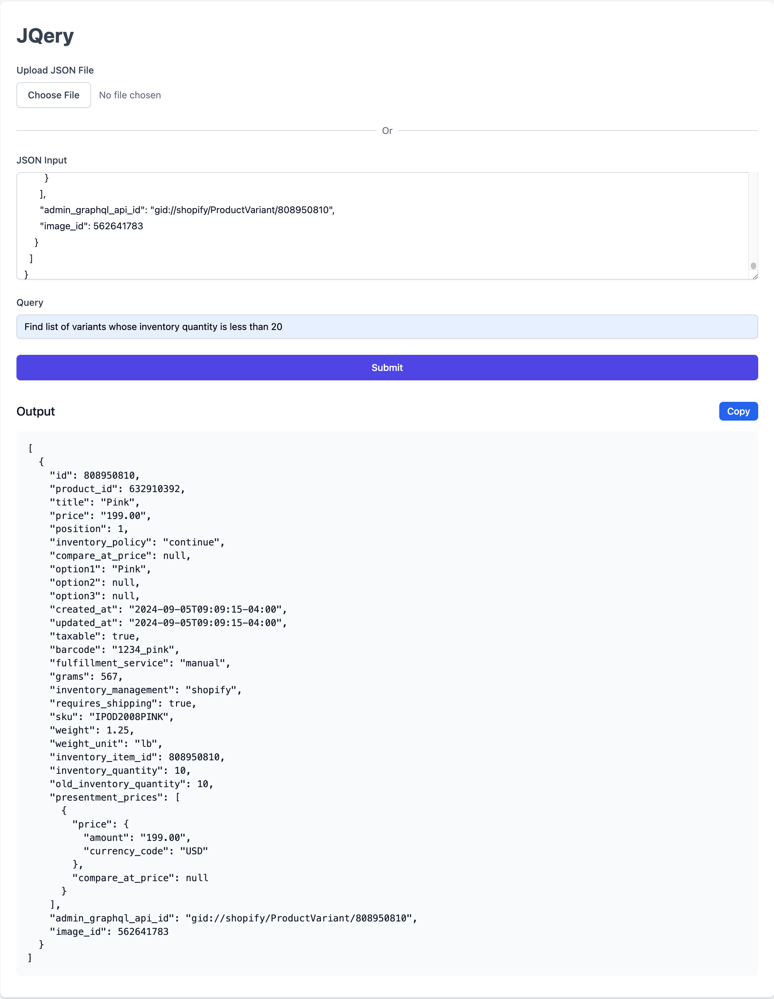

# JQery

A self-hosted solution to query your JSON in natural language using power of jq and LLMs.
No more need to learn jq commands to query your JSON. Just use natural english to ask questions to your JSON.

## App Intro

[](https://www.youtube.com/watch?v=XJu4gJYhdKA)

## App Screenshots



## Requirements

Local Dev

- Node - `>=v20.x.x`

## Local Setup

Pre-requisites

- Node >v20.x.x - recommended to install via some node version manager like [nvm](https://github.com/nvm-sh/nvm) or [n](https://github.com/tj/n)

Once the Node is installed, please run below commands to install and run the app locally

#### 1. Install dependencies:

```sh
npm install
```

#### 2. Setup Anthropic API key:

Create `.env` file in the root of the project and add below line

```
ANTHROPIC_API_KEY=<your-anthropic-api-key>
```

#### 3. Run app

```sh
npm run dev
```

## Deploy

Check out this video on how to self host this app

[](https://www.youtube.com/watch?v=g1Qcr6ubGQI)
